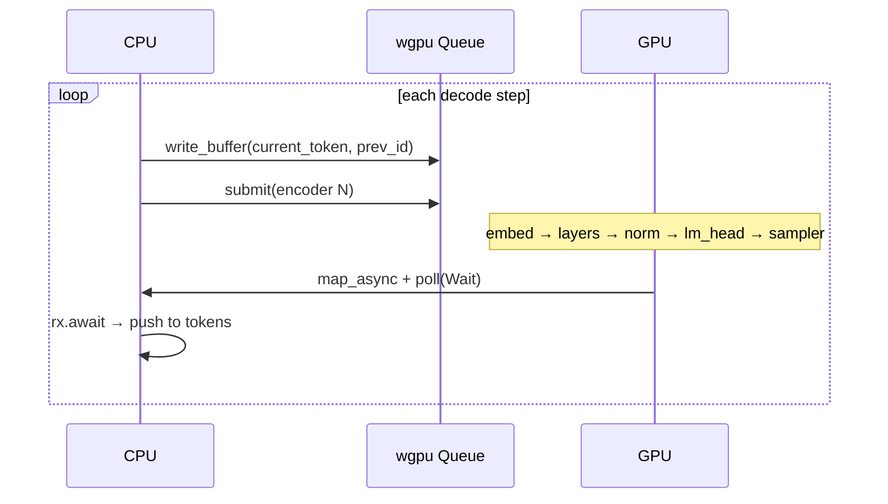
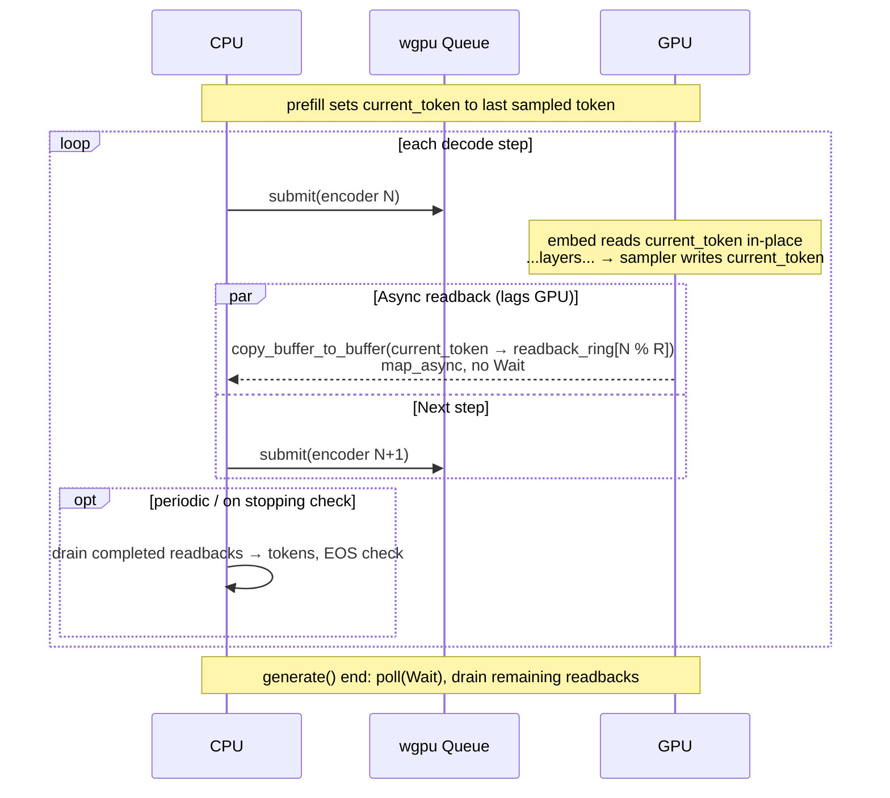

# Pure-GPU Continuous Decode

Status: **design draft, not implemented**
Companion to: [`docs/lm-head-sampler-backend.md`](lm-head-sampler-backend.md)
Target: [`src/language_model/gpu.rs`](../src/language_model/gpu.rs) — `Qwen35GpuSession`

## 1. Problem

`Qwen35GpuSession::step` today pays two CPU↔GPU round-trips per decode step that are not necessary on the fast path:

1. **`queue.write_buffer(&current_token, &input_ids[0])`** at the top of every `step`. The previous step's GPU sampler **already wrote that exact value** into `current_token`; the embed kernel can read it directly.
2. **`device.poll(PollType::Wait { … })` + `rx.await`** at the bottom of every `step` to map a 1×`u32` readback buffer and pull the sampled token id back to the CPU. This blocks the decode loop end-to-end on a host-visible map.

Bench-decode currently measures **30.73 tok/s** (32.5 ms / token). For a Qwen3.5-0.8B with a 248 K-vocab tied lm-head on consumer wgpu, the mat-mul bandwidth floor is ~1.3 ms / token, so **most of the per-step time is fixed latency on those two round-trips, not compute or memory bandwidth**.

## 2. Prior art

Three reference designs, all confirming that per-step blocking readback is the universal anti-pattern:

- **vLLM v1 (`gpu_model_runner.py`, async scheduling path).** Sampled tokens stay in a persistent GPU tensor (`prev_sampled_token_ids`) and are scattered directly into the next step's `input_ids` via `input_ids.gpu[:n].copy_(prev_sampled_token_ids[:n, 0], non_blocking=True)`. A pinned-CPU mirror is filled by a `non_blocking=True` D2H on a dedicated `async_output_copy_stream`; the engine only synchronizes the corresponding `transfer_event` when it actually needs to deliver a token to the user.
- **vLLM v0.6 blog (Sept 2024), "Asynchronous output processing"** — explicit rationale: process step *n*'s output **while** step *n+1* is computing on the GPU. Cost: at most one over-shoot step past EOS. Benefit: GPU never idles on a CPU round-trip.
- **llama.cpp (`src/llama-context.cpp`).** Uses `ggml_backend_tensor_get_async` to D2H either the full logits row or — with the recently-merged backend sampling path — just the `int32` sampled token id. `llama_context::synchronize()` runs **lazily**, only when the caller invokes `llama_get_logits()` / `llama_get_sampled_token_ith()`. A loop that just appends tokens never stalls mid-stream.
- **PyTorch `gpt-fast`.** Wraps `decode_one_token` in `torch.compile(mode="reduce-overhead")` which captures it as a **CUDA Graph**. Tokens stay on device as ordinary intermediate tensors of the captured graph; per-token D2H only happens when the user-visible stream needs them. Reported speedup over eager baseline: **25.5 → 107 tok/s (4.2×)**, almost entirely from eliminating per-step CPU overhead at batch=1.

The unified pattern across all four: **generated token ids live in a GPU buffer that the next step reads directly; host-side mirroring (for EOS / streaming / final delivery) is asynchronous and lags the GPU by ≥ 1 step.**

## 3. Today's shape (decode path)

```rust
// Qwen35GpuSession::step, num_new == 1 case
queue.write_buffer(&self.current_token, 0, bytemuck::bytes_of(&input_ids[0]));
self.run_and_read_back_token(device, queue, &self.decode_runner).await
//                          ^ submits one encoder; map_async + poll(Wait) + await
```



Two synchronous CPU→GPU edges and one synchronous GPU→CPU edge per token.

## 4. Proposed shape



**Invariants:**

- The token data path stays entirely on the GPU between steps. `current_token` is written **only** by the GPU sampler (or by `write_buffer` once at prefill, and on caller-forced rewrites — see §6).
- Host-side `tokens: Vec<u32>` lags the GPU by **up to `R−1` steps**, where `R` is the readback ring depth. The host catches up on demand (EOS check, end of `generate`).
- `poll(Wait)` only at end of `generate`, never inside the per-step body.

## 5. State changes vs. today

`Qwen35GpuSession` gains:

| field | type | purpose |
|---|---|---|
| `readback_ring` | `Box<[wgpu::Buffer; R]>` | R mappable 1×`u32` buffers; round-robin per step |
| `readback_inflight` | `VecDeque<InflightReadback>` | tracks `(slot, oneshot::Receiver<…>)` per in-flight step |
| `pending_tokens_drained_through` | `usize` | how far `self.tokens` is caught up |

and **loses** the per-step `queue.write_buffer(current_token, …)` on the decode fast path.

`R` (ring depth) sizing: small (4–8) is enough — it just needs to cover the worst-case scheduling jitter between when the GPU finishes a step and when the host polls. Backpressure: if the ring is full, the host blocks on the oldest in-flight readback before launching the next step. In practice this should almost never fire.

## 6. API surface

The user-facing `step` / `generate` signatures don't change. Two new behavioral notes documented on `step`:

- The `input_ids[0]` argument on a **decode** call (`num_new == 1`) is **ignored by default** — the GPU sampler's previous output is used. To force a specific token (speculative-decoding rejection path, retry, etc.), the caller uses a new method `step_force(device, queue, forced_id, params)` that re-asserts `current_token` via `write_buffer` and stalls any in-flight readbacks first. Rationale: this keeps the fast path branch-free while still surfacing the "force a token" capability when needed.
- The returned `SampledToken { id, logprob: NaN }` is **eventually consistent** on the GPU path. After `step` returns, the GPU has dispatched the work, but the `id` is only guaranteed to be the **actual sampled token** after the corresponding readback resolves. `generate` handles this internally; direct `step` callers who need a synchronous id should use a new `step_sync(device, queue, params) -> SampledToken` that waits for that step's readback.

In practice for our current code (`main.rs`, `bench_decode.rs`) the only API used is `generate`, so neither escape hatch affects the smoke / bench path.

## 7. EOS / stopping criteria

vLLM-style **lazy, lagging**:

- After each step, **try-drain** any completed readbacks (non-blocking) into `self.tokens`, and run `stopping.iter().any(|s| s.is_done(&self.tokens, tok))` on the newly-drained tokens.
- If a stopping criterion fires at the just-drained step `K`, **stop launching new steps**. Up to `R−1` in-flight steps past `K` are simply discarded (their readbacks are awaited but not appended).
- At the end of `generate`, do a single `device.poll(Wait)` and drain whatever remains, truncating to the position of the first stopping hit if any.

Cost: **at most `R−1` over-shoot tokens of wasted GPU work** past a true EOS. For `R = 4` and a 30 tok/s baseline that's ~100 ms of wasted compute on a stop; negligible relative to the per-stream win, and identical to vLLM's "one extra step" trade-off (just with a slightly deeper pipeline).

## 8. Prefill interaction

Prefill is unchanged in structure:

- Caller writes prompt token ids into `prefill_tokens` (real `write_buffer`).
- Build one-shot prefill runner; embed reads the prefill_tokens slice.
- Sampler writes the last token's sampled id into `current_token`.

The handoff to decode is **automatic**: after a prefill step, `current_token` holds the first generated token, and the next decode step reads it. No extra `write_buffer` needed at the prefill→decode boundary.

## 9. Estimated impact

Rough math from the current bench:

- Current: 30.73 tok/s = 32.5 ms / token.
- LM-head mat-mul bandwidth floor: 248 K × 1024 bf16 ≈ 254 MiB streamed per token; on a ~200 GB/s consumer GPU that's ~1.3 ms.
- Other per-step compute (24 layers × {RMSNorm + Q/K/V + RoPE + attention + out_proj + MLP}) is dominated by per-layer mat-vecs over 1024-dim hidden on small weights; expected on the order of a few ms total.
- Remaining ~25 ms is **fixed CPU↔GPU round-trip latency**: one `write_buffer`, one `submit`, one `copy_buffer_to_buffer`, one `map_async`, one `device.poll(Wait)`, one `rx.await`, one bind-group rebuild for the per-step uniform.

Eliminating the two synchronous round-trips and the `write_buffer` saves at least the `poll(Wait) + rx.await` cost — observed in similar wgpu workloads to be **3–8 ms per step on consumer Vulkan / D3D12 backends**.

Expected new tok/s (conservative / optimistic):

- Save 3 ms / step: 32.5 → 29.5 ms / token → **~34 tok/s** (10% gain).
- Save 8 ms / step: 32.5 → 24.5 ms / token → **~41 tok/s** (33% gain).
- Save 12 ms / step (if `submit` overhead also overlaps via pipelined encoders): 32.5 → 20.5 ms / token → **~49 tok/s** (60% gain).

Realistic estimate: **~40–50 tok/s, i.e. 1.3–1.6× decode speedup**, TTFT unchanged. The actual number depends heavily on the wgpu backend's `map_async` + `poll(Wait)` latency on this hardware; profiling after the change will tell us whether to escalate to vLLM-style multi-step batching (§10).

For comparison: gpt-fast on A100 / batch=1 saw **4.2×** from the same class of fix (`torch.compile(mode="reduce-overhead")` ⇒ CUDA Graphs + on-device tokens), but their baseline had heavier Python overhead than our Rust loop. Our ceiling is set by the hardware's `submit` / `poll` granularity.

## 10. Out of scope (future work)

- **Multi-step batching**: chaining N decode dispatches into one encoder + one submit. vLLM PR #7000 ("multi-step scheduling") got +28% throughput on Llama-70B from this. Trades immediacy for throughput; consider after we have a profile of the post-§4 pipeline.
- **GPU PRNG + temperature / top-k / top-p / min-p kernels**: this is migration step 7 from the original sampler-backend doc, parked there.
- **Speculative decoding** (verify token N+k against a draft model): would re-use the `step_force` escape hatch from §6.

## 11. Migration plan

1. **Add the readback ring** to `Qwen35GpuSession::new` (R = 4 to start). Convert `token_readback` from a single buffer to `[wgpu::Buffer; R]`.
2. **Drop the decode-path `write_buffer(current_token, …)`** when `num_new == 1` and `self.position > 0` (i.e. there's been at least one prefill or decode step that wrote `current_token`). On the first decode step of a fresh session this fires only if prefill ran; assert that as a debug invariant.
3. **Rewrite `run_and_read_back_token`** as `submit_step_and_enqueue_readback`: submits the encoder, issues `copy_buffer_to_buffer` into `readback_ring[step_idx % R]`, calls `map_async` with the oneshot, and **returns immediately** without polling.
4. **Add `drain_completed_readbacks`** (non-blocking): inspects the queue's front, polls the `oneshot` `try_recv`, appends to `self.tokens` on success. Called once per step in `generate`'s loop and at the top of `step_sync`.
5. **Rewrite `generate`** to: launch up to `R` steps in flight, drain after each launch, check stopping on drained tokens; if EOS hit, stop launching; final `device.poll(Wait)` + drain at end.
6. **Add `step_force` and `step_sync`** as the explicit escape hatches. Keep `step` as the fast (eventually-consistent) primitive `generate` uses internally; document the consistency model.
7. **Profile + iterate**: capture per-step wgpu trace before / after, confirm the wins are where we predicted; record actual tok/s in `benches/baselines.local.csv`.
8. **(Deferred)** Validate identical token output against the pre-change reference. The greedy sampler is deterministic, so tokens **must** match `[1049, 369, 5995, 310, 381]` ("It is designed to be") bit-for-bit.

## 12. Risks

- **wgpu `submit` ordering on `current_token` read-after-write across encoders.** In one encoder we already have RAW on `current_token` between sampler dispatch and (next step's) embed dispatch. Across separate `submit`s, wgpu's queue is in-order per-queue, so RAW is still respected. Confirm via a small test that launches two back-to-back submits sharing a single STORAGE buffer.
- **`map_async` completion latency**. If the wgpu backend doesn't fire the callback until `device.poll` is called, our `drain_completed_readbacks` needs to call `device.poll(PollType::Poll)` (non-blocking) once per loop iteration. Cheap, but easy to forget. Mitigation: a one-line comment at the drain call site, plus a debug assertion that we never see `R` in-flight readbacks all unresolved after a `Poll`.
- **Async readback fires while next `submit` is writing `current_token`.** Not a real issue: the `copy_buffer_to_buffer` from `current_token → readback_ring[k]` is recorded into the *same* encoder as step `k`'s dispatches, so the copy is scheduled right after the sampler writes — strictly before step `k+1`'s encoder begins on the device queue.
- **Backpressure on ring full**. If R consecutive readbacks all stall (e.g. CPU goes to sleep), the next `submit_step` must block on the oldest. This is the same shape as the current behavior for that one step, so worst-case is equal to today, not worse.
